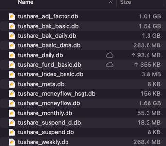

# Tutake

Take data from Tushare, respect Tushare!

1. 支持定时自动化的下载tushare数据，保证数据的同步
2. 支持本地的数据查询，性能和效率更高（当前使用sqlite,后续计划支持多类型数据库）
3. 支持原生的查询，分析的维度更灵活（sql还是很强大的）
4. 支持接口的扩展，常用的数据组合接口可以通过扩展的方式统一调用

## 背景

> 最近发现量化是件有趣的事情，但相关数据的采集是件颇为棘手的事情，幸亏有Tushare， 可发现需要进行全市场的回测远程的接口性能还是有点弱，所以思考如何把数据存储到本地

## 实现

> 因为Tushare api及doc完整度非常高，就有了本项目的想法和实践--基于Tushare的api
> doc自动化的生成Tushare数据的全量同步及增量更新的代码，复用Tushare接口查询本地数据，同时支持定时执行数据同步。

## 使用

### Step1 设置配置文件

clone 代码后复制配置文件 `config-default.yml` -> `config.yml`
需要配置两个参数：

```yaml
#执行时需要将这个文件调整为 config.yml
tutake:
  data:
    driver_url: sqlite:////Users/xxx/tutake/data  # sqlite的driver的地址，制定到存放下载数据的目录，注意不同操作系统的/可能会有差异
  process:
    thread_cnt: 10
  scheduler:
    timezone: Asia/Shanghai
    background: False
    tasks:
      - default: 10 0 * * *   #定时任务执行脚本
      - stock_basic: 0 0 * * * 

tushare:
  token: #tushare api 的token，如果需要获取所有的数据，需要5000以上的积分
```

### Step2 下载股票列表

可以参考 <a href="main.py">main.py</a>
执行main函数，开始同步下载数据

```python
from tutake import task_api
from tutake.utils.config import TutakeConfig
from tutake.utils.utils import file_dir

if __name__ == '__main__':
    task = task_api(TutakeConfig(file_dir(__file__)))
    task.start(True)  # 如果设置为True,则立即开始执行 
```

### Step3 查询数据
下载完数据就可以从本地查询数据:

```python
import tutake

if __name__ == '__main__':
    api = tutake.pro_api(data_dir='/xxx/data_dir')
    print(api.daily())
```
显示查询结果：
```python
        ts_code trade_date    open    high  ...  change   pct_chg      vol   amount
0     600601.SH   19901219  185.30  185.30  ...  184.30  18430.00     50.0     37.0
1     600602.SH   19901219  365.70  384.00  ...  383.00  38300.00   1160.0    443.0
2     600656.SH   19901219    2.60    2.60  ...    1.60    160.00     50.0     13.0
3     600601.SH   19901220  185.30  194.60  ...    9.30      5.02     21.0     16.0
4     600602.SH   19901220  403.20  403.20  ...   19.20      5.00    149.0     60.0
...         ...        ...     ...     ...  ...     ...       ...      ...      ...
5995  000004.SZ   19920817   27.75   28.60  ...    0.10      0.36    872.0  12210.0
5996  000006.SZ   19920817   54.85   56.50  ...    1.50      2.77    307.0   8586.0
5997  000007.SZ   19920817   35.05   35.05  ...    0.75      2.23    278.0   4799.0
5998  000008.SZ   19920817   24.50   25.50  ...    0.50      2.08    210.0   2609.0
5999  000009.SZ   19920817   30.75   32.65  ...    1.10      3.59  27951.0  89526.0

[6000 rows x 11 columns]
```

使用pro_bar接口获取更复杂的数据，例如获得000002.SZ的前复权数据：
```python
import tutake

if __name__ == '__main__':
    api = tutake.pro_api(
        data_dir='/xxx/data_dir')
    print(tutake.pro_bar(api, ts_code='000002.SZ', adj='qfq'))
```

```python
        ts_code trade_date     open  ...    pct_chg         vol        amount
0     000002.SZ   19910129   0.5819  ...  1358.3960        3.00  2.200000e+01
1     000002.SZ   19910130   0.5791  ...    -0.4812       17.00  1.230000e+02
2     000002.SZ   19910204   0.5851  ...     0.4809       56.00  4.100000e+02
3     000002.SZ   19910205   0.5879  ...     0.4786       29.00  2.130000e+02
4     000002.SZ   19910206   0.5907  ...     0.4763       29.00  2.150000e+02
...         ...        ...      ...  ...        ...         ...           ...
5995  000002.SZ   20160824  18.7467  ...    -2.8745  1470675.59  3.561540e+06
5996  000002.SZ   20160825  18.0553  ...    -1.8756  1821374.91  4.234199e+06
5997  000002.SZ   20160826  18.1244  ...    -2.7613  1200024.09  2.780659e+06
5998  000002.SZ   20160829  17.5636  ...     0.0876   782446.19  1.796321e+06
5999  000002.SZ   20160830  17.6327  ...    -1.0914   909262.53  2.072873e+06

[6000 rows x 11 columns]
```

#### 原生查询
一些特殊场景下需要需要更多维度的查询，所以也支持使用sql查询。
只需要通过接口前加上_就可以，比如股票基本信息`stock_basic`接口可以用`_stock_basic`来访问，
具体可以参考 <a href="test/query_test.py">query_test.py</a>
```python
# query_test.py
def sql_query(self):
    """
        查询上市和停市的股票数量 可以使用{table}占位符
    """
    print(self.api._stock_basic.sql("select list_status,count(*) cnt from {table}  group by list_status"))
```

查询结果：
```python
  list_status   cnt
0           D   192
1           L  5008
```

也可以查看接口的元数据：
```python
# query_test.py
def meta_query(self):
    print(self.api._stock_basic.meta())
```
结果如下：
```json lines
{
  "table_name": "tushare_stock_basic",
  "columns": [
    {
      "name": "ts_code",
      "type": "String",
      "comment": "TS代码"
    },
    {
      "name": "symbol",
      "type": "String",
      "comment": "股票代码"
    },
    {
      "name": "name",
      "type": "String",
      "comment": "股票名称"
    },
    {
      "name": "area",
      "type": "String",
      "comment": "地域"
    },
    {
      "name": "industry",
      "type": "String",
      "comment": "所属行业"
    },
    {
      "name": "fullname",
      "type": "String",
      "comment": "股票全称"
    },
    {
      "name": "enname",
      "type": "String",
      "comment": "英文全称"
    },
    {
      "name": "cnspell",
      "type": "String",
      "comment": "拼音缩写"
    },
    {
      "name": "market",
      "type": "String",
      "comment": "市场类型"
    },
    {
      "name": "exchange",
      "type": "String",
      "comment": "交易所代码"
    },
    {
      "name": "curr_type",
      "type": "String",
      "comment": "交易货币"
    },
    {
      "name": "list_status",
      "type": "String",
      "comment": "上市状态 L上市 D退市 P暂停上市"
    },
    {
      "name": "list_date",
      "type": "String",
      "comment": "上市日期"
    },
    {
      "name": "delist_date",
      "type": "String",
      "comment": "退市日期"
    },
    {
      "name": "is_hs",
      "type": "String",
      "comment": "是否沪深港通标的，N否 H沪股通 S深股通"
    }
  ],
  "default_order_by": "ts_code",
  "default_limit": ""
}
```


## 说明
因为数据量比较大，全量的数据超过百G，但是tushare有限速限量的各种约束，所以建议使用多个高等级的账号（5000积分以上的账号），工程支持配置多个账号，然后自动适配限流下载，全量数据下载完后，每天的增量数据量很小，通常10分钟内下载完毕，
目前调试的接口是按照个人需要生成的，还有很多接口没有生成，如果有需要的可以留言，或者阅读代码自行添加。目前的接口基本覆盖了股票、基金、指数、期货相关的接口

## 关于数据
基本一个接口会有一个数据文件，但是数据文件会比较大，如果有人想直接要这个数据，也可以加Star留言




## 计划
目前距离生产可用性的距离还很远，但是希望能不断优化接近高可用，当然还有更多的功能也会不断增加
